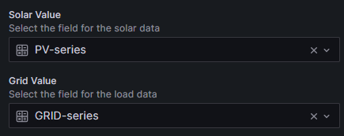

# Solar Flow Visualisation

This is a simple visualisation of your solar panel production flow designed to be displayed on a Grafana dashboard.

## Installation

1. Add the solar-flow plugin to your Grafana dashboard
2. Create a data source for your solar panel production data
3. Provide the queries for PV and Grid data entries
4. Adjust the panel settings to your needs and observe your solar Production/Consumption/Waste ratio on your dashboard

