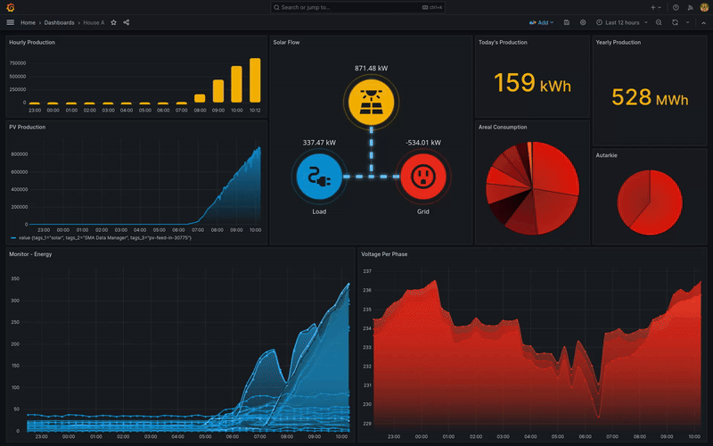

# Solar Flow Visualisation

Solar Flow is a simple animated visualization of solar panel production flow, designed to be displayed as a plugin on a
Grafana dashboard.

## Installation

1. Add the Solar Flow plugin to your Grafana dashboard
2. Create a data source of your solar panel production data
3. Provide the query for the PV and Grid data in the plugin settings
4. Adjust the panel settings to your needs and observe your solar Production/Consumption/Waste ratio on your dashboard

## Data Requirements

The plugin is expecting to receive the PV and Grid data in one query. If your data is stored in two separate tables, you can use Grafana's Data-Merge feature to combine them into one query. (Refer to Grafana's [documentation](https://grafana.com/docs/grafana/latest/panels-visualizations/query-transform-data/transform-data/#transform-data) for more information)

## Options

Our plugin has some options that can be adjusted to your needs:

### Solar/Grid Value:
These two are the most important settings in the plugin. They define the fields from your data source that contain the solar
panel production and grid energy data. The plugin will use these values to calculate the load energy and visualize the flow of energy.
After you provided an appropriate data source and query, you need to choose the Solar and Grid values from the dropdown list.

### Additional Source Value:
This setting allows you to add an additional energy source to the visualization. This can be useful if you have a battery or another energy source that you want to visualize. If you don't have an additional source, you can leave this field empty.

### Zoom
This settings allows you to scale the visualization to your needs.

### Offset
Allows you to adjust the offset of the plugin.

### Show Legend
Simply toggle to true if you want the load and grid energy points to be labeled for clearer understanding

### Color Palette
You can define such colors as:
- `Solar Color` - the color of the solargu panel production flow
- `Grid Color` - the color of the grid energy flow
- `Load Color` - the color of the load energy flow
- `Additional Source Color` - the color of the addition energy source
- `Lines Color` - the color of the lines connecting the points

## Final Result (example):

## Contributing

Pull requests are welcome. For major changes, please open an issue first to discuss what you would like to change.

### Development Environment Setup

1. Clone the repository
2. Run `npm install` to install the dependencies
3. Run `npm run build` to build the plugin
4. Run `sudo docker compose up` to start the development environment
5. Run `sudo npm run dev` to start the actual plugin simultaneously
6. Open `http://localhost:3000` in your browser and login with the default credentials (admin:admin)
7. Add a new dashboard and add the Solar Flow plugin to it
8. Create a new data source and provide the queries for the solar panel production data. Or create a grafana test data source