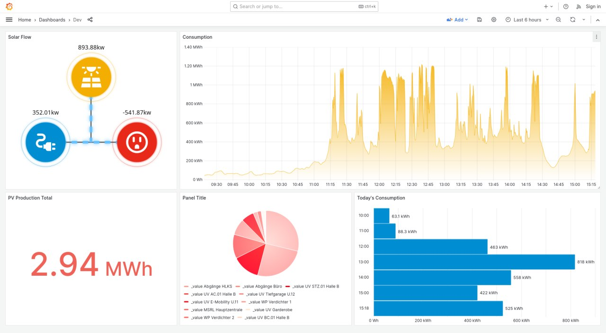

# Solar Flow Visualisation

Solar-Flow is a simple visualization of solar panel production flow, designed to be displayed as a plugin on a Grafana dashboard.

## Installation

1. Add the solar-flow plugin to your Grafana dashboard
2. Create a data source of your solar panel production data
3. Provide the queries for PV and Grid data entries
4. Adjust the panel settings to your needs and observe your solar Production/Consumption/Waste ratio on your dashboard

