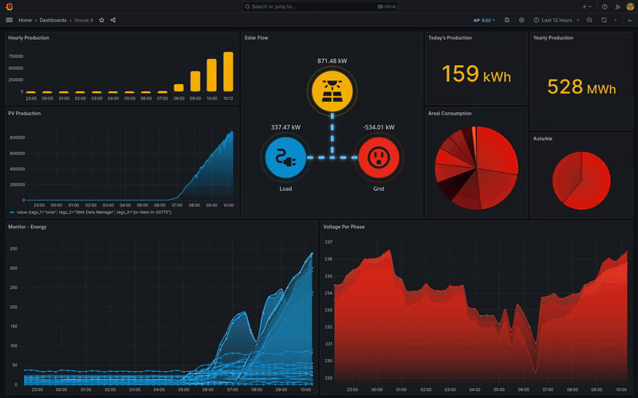

# Solar Flow Visualisation

Solar Flow is an animated visualization of solar panel energy flow, designed as a Grafana panel plugin. It shows real-time energy movement between PV, Grid, Load, and up to 3 additional sources (battery, wallbox, etc.) with smooth particle-style animations.

## Installation

1. Add the Solar Flow plugin to your Grafana dashboard
2. Create a data source for your solar panel production data
3. Provide the query for PV and Grid data in the plugin settings
4. Adjust the panel options to your needs

## Data Requirements

The plugin expects PV and Grid data from your data source. If your data is stored in separate tables, use Grafana's [Data Transform](https://grafana.com/docs/grafana/latest/panels-visualizations/query-transform-data/transform-data/#transform-data) feature to combine them into one query.

## Options

Options are organized into collapsible groups in the panel editor sidebar.

### Data Sources
- **Solar Value** — Field containing solar panel production data
- **Grid Value** — Field containing grid energy data
- **Load Value** *(optional)* — Direct load reading from the inverter. If set, overrides the calculated value (PV + Grid + Additional Sources)
- **Measurement Unit** — `Auto` (W below 1000, kW above), `kW`, or `W`

### Additional Sources (0–3)
Configure up to 3 additional energy sources (battery, wallbox, EV charger, etc.). Select the number of sources from the count selector — options for each source appear dynamically.

Each source has:
- **Value** — Energy data field
- **SOC Value** *(optional)* — State of Charge field (e.g. battery percentage)
- **Label** — Display name
- **Icon** — Battery, EV Panel, or Solar Panel
- **Color** — Circle color
- **Always Show** — Show even when value is 0

Layout adapts automatically:
- **1 source** — centered below the hub
- **2 sources** — side-by-side with a sub-junction
- **3 sources** — row of three with a sub-junction

### Animation
- **Energy Line Threshold** — Minimum value to show animated energy lines
- **Speed Reference (W)** — Power level at which animation runs at 1s/cycle. Lower = faster at low values

### Layout
- **Padding** — Space between the diagram and panel edges
- **Show Legend** — Label the energy points

### Colors
- **Solar** / **Load** / **Grid** / **Lines** — Color pickers for core diagram elements

## Releasing

This project uses GitHub Actions for automated builds and releases.

### Creating a release

1. Bump the version:
   ```bash
   npm version patch   # or minor / major
   ```
2. Push the tag:
   ```bash
   git push origin main --follow-tags
   ```
3. The release workflow builds, signs, and creates a draft GitHub release with the plugin zip
4. Edit and publish the draft release on GitHub

### Setup requirements

To enable plugin signing, add a `GRAFANA_ACCESS_POLICY_TOKEN` to your [repository secrets](https://docs.github.com/en/actions/security-for-github-actions/security-guides/using-secrets-in-github-actions). Refer to the [Grafana sign-a-plugin docs](https://grafana.com/developers/plugin-tools/publish-a-plugin/sign-a-plugin#generate-an-access-policy-token) to generate the token.

## Development

```bash
npm install        # Install dependencies
npm run dev        # Start webpack in watch mode
npm run server     # Start Grafana via docker-compose
npm run build      # Production build
npm run lint       # Lint
npm run typecheck  # Type check
npm run test:ci    # Run tests
```

## Example


