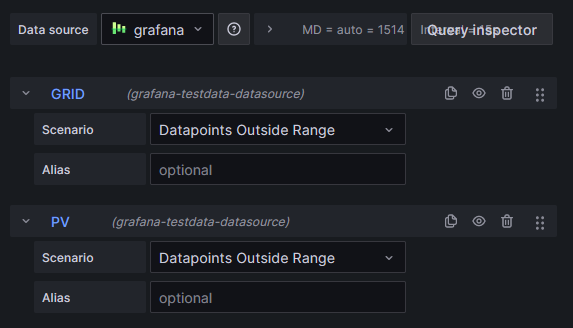

# Solar Flow Visualisation

Solar Flow is a simple animated visualization of solar panel production flow, designed to be displayed as a plugin on a
Grafana dashboard.

## Installation

1. Add the Solar Flow plugin to your Grafana dashboard
2. Create a data source of your solar panel production data (Watch the example queries below
3. Provide the queries for PV and Grid data entries
4. Adjust the panel settings to your needs and observe your solar Production/Consumption/Waste ratio on your dashboard

## Data Requirements

> [!WARNING]
> 1. The queries must be sent in this order 1: Grid data 2: Solar data

> 2. The parameter `Value First` must be adjusted according to your database's timestamp presence/absence. Read below.
## Options

Our plugin has two options that can be adjusted to your needs:

### 1. Value First:
Depending on the fact if your database sends a timestamp with the actual value, you have to toggle the parameter according to the timestamp's absence/presence  
In other words, if the value is the only/first data entry - check the parameter to true, otherwise - false. Examples below:
```
  "data": {
    "values": [
       [10] <--- First and only data entry. Value First - true
    ]
  }
```
```
  "data": {
    "values": [
      [1713751547175], <--- First data entry
      [10] <--- Second data entry. Value First - false
    ]
  }
```
>[!NOTE]
> Use the query inspector in order to see if you receive the timestamp alongside with the value
### 2. Show Legend
Simply toggle to true if you want the load and grid energy points to be labeled for clearer understanding

### Color Scheme
You can define such colors as:
- `Solar Color` - the color of the solar panel production flow
- `Grid Color` - the color of the grid energy flow
- `Load Color` - the color of the load energy flow
- `Lines Color` - the color of the lines connecting the points

## Final Result (example):


## Contributing

Pull requests are welcome. For major changes, please open an issue first to discuss what you would like to change.

### Development Environment Setup

1. Clone the repository
2. Run `npm install` to install the dependencies
3. Run `npm run build` to build the plugin
4. Run `sudo docker compose up` to start the development environment
5. Run `sudo npm run dev` to start the actual plugin simultaneously
6. Open `http://localhost:3000` in your browser and login with the default credentials (admin:admin)
7. Add a new dashboard and add the Solar Flow plugin to it
8. Create a new data source and provide the queries for the solar panel production data. Or create a grafana test data source